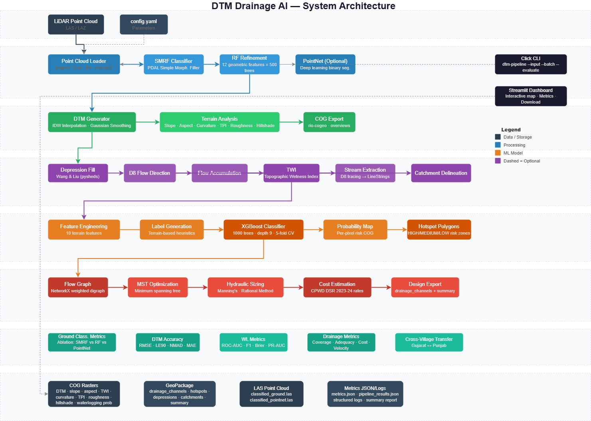

# DTM Drainage AI

[](LICENSE)
[](https://www.python.org/downloads/)

Automated pipeline that turns drone LiDAR point clouds into a 0.5 m Digital Terrain Model, waterlogging risk map, and cost-optimised drainage network — in one command.

Built for the MoPR Geospatial Intelligence Hackathon (IIT Tirupati).

## Pipeline

```
LAS/LAZ  →  Inspect  →  Ground Classify  →  DTM + Derivatives  →  Hydrology  →  Waterlogging Risk  →  Drainage Design
            laspy        PDAL SMRF + RF      IDW + rio-cogeo       pysheds       XGBoost               MST + Manning's
```
## Detailed Pipeline:


| Stage | What | Output |
|-------|------|--------|
| 1 | Inspect LAS header, CRS, density; auto-tile | Metadata |
| 2 | SMRF ground filter + RF refinement | `classified_ground.las` |
| 3 | IDW interpolation → 0.5 m COG + 8 derivatives | `dtm.tif`, slope, TPI, curvature |
| 4 | Fill depressions, D8 flow, accumulation, TWI, streams | `flow_*.tif`, `twi.tif`, stream layers |
| 5 | XGBoost on 10 terrain features | `waterlogging_probability.tif`, hotspots |
| 6 | MST channel routing + Manning's trapezoidal sizing | `drainage_network.gpkg` with cost |

## Quick Start

```bash
git clone https://github.com/charansaiponnada/DTM.git
cd DTM

# Create environment
uv venv
uv pip install -r requirements.txt

# Single village
python run_pipeline.py --input data/input/DEVDI_511671.las --evaluate

# All villages from config
python run_pipeline.py --batch
```

Or install as a package:
```bash
pip install -e .
dtm-pipeline --input data/input/DEVDI_511671.las
```

### Python API

```python
from src.pipeline import DTMDrainagePipeline

pipeline = DTMDrainagePipeline(
    config_path="config/config.yaml",
    input_las="data/input/DEVDI_511671.las",
    output_dir="data/output/DEVDI",
)
results = pipeline.run(use_ml_refine=True, stream_threshold=1000)
```

## Structure

```
├── run_pipeline.py          # CLI entry point
├── run_pipeline.bat         # Windows batch runner
├── install.bat              # Windows setup
├── pyproject.toml           # Project metadata + dependencies
├── LICENSE                  # MIT
│
├── src/                     # Python package
│   ├── cli.py               # Click CLI (entry points)
│   ├── pipeline.py          # DTMDrainagePipeline + BatchPipelineRunner
│   ├── logger.py            # Structured logging (loguru + rich)
│   ├── features.py          # Shared terrain features
│   ├── preprocessing/       # LAS I/O, SMRF, PointNet
│   ├── dtm/                 # IDW interpolation, COG, derivatives
│   ├── hydrology/           # Flow analysis, waterlogging, drainage
│   └── evaluation/          # Accuracy metrics for all stages
│
├── app/                     # Streamlit web UI
├── scripts/                 # Utilities: download, eval, figures
├── config/config.yaml       # All tunable parameters
├── tests/                   # pytest suite
├── notebooks/               # Jupyter exploration
├── docs/                    # Images, presentation, report
└── data/
    ├── input/               # LAS/LAZ point clouds (gitignored)
    └── output/              # Pipeline results (gitignored)
```

## Output Formats (OGC-compliant)

- **Rasters**: Cloud-Optimized GeoTIFF — DTM, slope, aspect, TWI, curvature, TPI, roughness, hillshade, waterlogging probability
- **Vectors**: GeoPackage — drainage channels (with hydraulic specs), waterlogging hotspots, depressions, catchments, design summary
- **Point cloud**: LAS 1.4 — ground-classified

## Key Results

| Village | State | Points | DTM RMSE | DTM LE90 | Channels | Cost (₹L) |
|---------|-------|--------|----------|----------|----------|-----------|
| Devdi | Gujarat | 76M | 0.18 m | 0.23 m | 966 | 434 |
| Khapreta | Gujarat | 193M | 0.15 m | 0.19 m | 575 | 233 |
| Dhal Hoshiarpur | Punjab | 35M | 0.10 m | 0.13 m | 297 | 79 |
| Chakhirasingh | Punjab | 10M | 0.25 m | 0.39 m | 1013 | 351 |

## Tech

| Domain | Libraries |
|--------|-----------|
| Point cloud | `laspy`, `pdal` |
| Raster | `rasterio`, `rio-cogeo`, `scipy` |
| Hydrology | `pysheds` |
| ML | `xgboost`, `scikit-learn` |
| Graph | `networkx` |
| GIS | `geopandas`, `shapely`, `pyproj` |
| CLI/UI | `click`, `loguru`, `rich` |

## License

MIT

Devoloped by Team - Charan Sai Ponnada, Naga Chaitanya Prathipati, Asha Ruksana, Neelima Vana, Leena.
