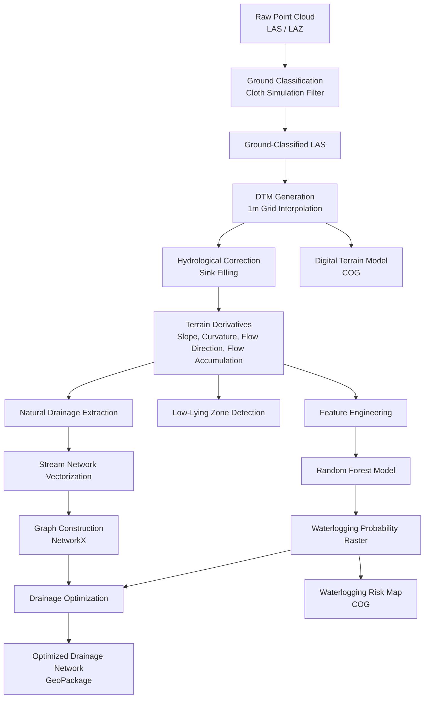
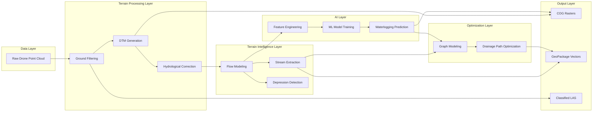

# System Design Document  
## AI-Driven DTM Creation and Drainage Optimization

# 1. System Overview

This system transforms unclassified drone-derived point cloud data into a governance-ready terrain intelligence solution.

The system integrates:

- Geometric ground classification
- Digital Terrain Modeling
- Hydrological simulation
- Machine learning-based risk prediction
- Graph-based drainage optimization

The architecture is modular and designed for reproducibility and scalability.

---
---

# Architecture Diagrams

## Pipeline Flow Diagram

## System-Level Architecture Diagram

---
# 2. Design Principles

1. Modularity  
Each processing stage is independently executable.

2. Standards Compliance  
All outputs follow open geospatial formats (COG, GPKG, LAS).

3. Hydrological Correctness  
DTM must be sink-filled before flow modeling.

4. Interpretability  
ML models must provide feature importance insights.

5. Scalability  
Pipeline must generalize to multiple villages.

---

# 3. Component Design

## 3.1 Ground Classification Module

Input:
Unclassified LAS/LAZ point cloud

Process:
Cloth Simulation Filter (CSF) applied

Output:
Ground-classified LAS file

Design Rationale:
- No labeled data available
- Intensity unusable
- Geometric filtering more stable than deep learning under hackathon constraints

---

## 3.2 DTM Generation Module

Input:
Ground-only point cloud

Process:
Grid interpolation at 1m resolution

Post-processing:
Sink filling to enforce hydrological continuity

Outputs:
DTM raster
Slope raster
Curvature rasters
Flow direction raster
Flow accumulation raster

Design Decision:
1m resolution selected as optimal balance between computational load and terrain detail.

---

## 3.3 Hydrological Modeling Module

Input:
Hydrologically corrected DTM

Process:
D8 flow routing
Accumulation computation
Threshold-based stream extraction
Watershed delineation
Depression detection

Outputs:
Stream network vector
Watershed polygons
Low-lying zone polygons

Design Decision:
D8 algorithm chosen for computational efficiency and interpretability.

---

## 3.4 Machine Learning Module

Objective:
Predict waterlogging risk using terrain-derived features.

Feature Set:
Elevation
Slope
Profile curvature
Plan curvature
Flow accumulation
Distance to stream

Model:
Random Forest Classifier

Training Strategy:
Cross-validation
Hyperparameter tuning
Feature importance analysis

Output:
Waterlogging probability raster

Design Decision:
Random Forest selected due to robustness, nonlinear modeling capability, and interpretability.

---

## 3.5 Drainage Optimization Module

Input:
Natural stream network
Waterlogging probability map

Process:
Stream network converted to graph
Edges weighted by length and slope constraints
Shortest path and connectivity optimization applied

Objective:
Minimize predicted stagnation zones
Improve connectivity to outlet

Output:
Optimized drainage network vector

Design Rationale:
Graph theory provides scalable infrastructure design simulation.

---

# 4. Data Flow

Raw LAS  
→ Ground Filtering  
→ DTM  
→ Hydrological Modeling  
→ Feature Engineering  
→ ML Prediction  
→ Drainage Optimization  
→ Final GIS Outputs  

---

# 5. Performance Considerations

Large point clouds handled using tiling and streaming.

Memory usage controlled by raster chunk processing.

CPU-based execution optimized for stability over deep learning approaches.

---

# 6. Risk Mitigation Strategy

Risk: Overfitting ML model  
Mitigation: Cross-validation and feature importance validation

Risk: Hydrological artifacts  
Mitigation: Sink filling and DTM smoothing

Risk: Computational overload  
Mitigation: 1m grid resolution and modular execution

---

# 7. Scalability Strategy

Pipeline configurable through parameter file:

- Grid resolution
- Flow accumulation threshold
- ML hyperparameters
- Optimization constraints

Designed to scale to additional villages without architectural change.

---

# 8. Deployment Guidelines

System can be executed:

- Module-by-module
- Or as an automated pipeline script

Outputs directly loadable into:

QGIS
ArcGIS
WebGIS systems

---

# 9. Conclusion

This system integrates geomatics engineering, hydrological science, machine learning, and graph optimization into a single terrain intelligence framework.

It moves beyond terrain visualization and delivers actionable drainage planning outputs aligned with governance needs.
