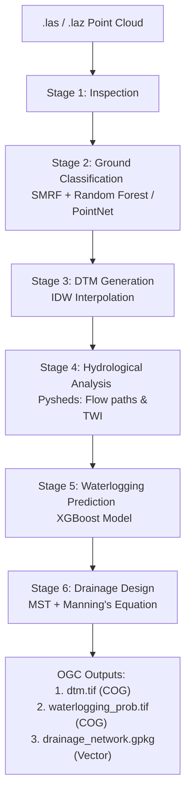

# Current Implementation: DTM & Drainage AI Pipeline
**MoPR Geospatial Intelligence Hackathon — IIT Tirupati**  
*Problem Statement 2: DTM Creation using AI/ML from point cloud data and development of drainage network*

---

## 1. Understanding the Problem Statement

The goal of this project is to leverage high-resolution drone point cloud data (LiDAR) to solve critical hydrological challenges in densely populated village (**abadi**) areas.

### Core Objectives:
1.  **AI/ML-Driven DTM Generation**: Automatically classify raw point clouds into ground and non-ground points to generate a high-resolution Digital Terrain Model (DTM).
2.  **Hydrological Delineation**: Identify natural surface-water flow paths, catchments, and topographic depressions.
3.  **Waterlogging Prediction**: Use AI/ML (XGBoost/PointNet) to predict flood-prone hotspots based on terrain-derived features.
4.  **Optimized Drainage Design**: Design a cost-effective, resilient drainage network using hydraulic principles (Manning's equation) and graph optimization (Minimum Spanning Tree).
5.  **OGC Compliance**: Ensure all data outputs (Rasters and Vectors) follow Open Geospatial Consortium standards.

---

## 2. Methodology

Our implementation follows a rigorous 6-stage pipeline that transitions from raw unstructured 3D data to actionable engineering designs.

### Stage 1: Data Inspection
- Validates CRS (Coordinate Reference System), point density, and intensity ranges.
- Handles data challenges like missing classification or zero-intensity values (common in the provided Gujarat datasets).

### Stage 2: Ground Classification (AI/ML)
- **Hybrid Approach**: Combines traditional filters (SMRF/CSF) with ML refinement.
- **ML Refinement**: A Random Forest classifier (or optional PointNet deep learning) trained on geometric features to remove false positives (e.g., building edges or low vegetation) from the ground class.

### Stage 3: DTM Generation & Terrain Analysis
- **Interpolation**: Uses Inverse Distance Weighting (IDW) to create a 0.5m resolution DTM.
- **Derivatives**: Calculates Slope, Aspect, Curvature, TPI (Topographic Position Index), and Roughness to feed the waterlogging model.

### Stage 4: Hydrological Analysis
- **Flow Modeling**: Depression filling (Wang & Liu), D8 Flow Direction, and Flow Accumulation.
- **Indices**: Calculation of Topographic Wetness Index (TWI) to identify saturation zones.
- **Vector Extraction**: Automated extraction of natural stream networks and catchment boundaries.

### Stage 5: Waterlogging Prediction (XGBoost)
- **Model**: An XGBoost classifier trained on 10+ terrain-derived features.
- **Output**: A probability map (0-1) and polygonized "Hotspot" layers for GIS integration.

### Stage 6: Optimized Drainage Network Design
- **Network Optimization**: Uses Minimum Spanning Tree (MST) on the flow graph to find the shortest, most cost-effective path to outlets.
- **Hydraulic Sizing**: Automatically sizes channels (Bottom Width, Depth, Velocity) using Manning’s Equation based on a 10-year design storm.

---

## 3. System Architecture



---

## 4. Current Implementation Status

We have successfully implemented the end-to-end pipeline. Below is the summary of what is completed:

- [x] **Point Cloud Loader**: Supports large files via tiled processing (tested on 163M point datasets).
- [x] **Ground Classifier**: Implemented SMRF filter with Random Forest refinement.
- [x] **DTM Generator**: Produces OGC-compliant Cloud-Optimized GeoTIFFs (COG).
- [x] **Hydrological Analyzer**: Full D8 flow analysis and TWI calculation.
- [x] **Waterlogging Predictor**: XGBoost model integrated into the pipeline.
- [x] **Drainage Designer**: Automated hydraulic sizing and cost estimation (INR).
- [x] **Evaluation Framework**: Automated metrics for DTM accuracy and classification performance.

---

## 5. How to Run

### Prerequisites
1.  Python 3.10+
2.  Install dependencies: `pip install -r requirements.txt`
3.  (Optional) For GPU PointNet: Install PyTorch with CUDA support.

### Run Single Village Pipeline
To process a single LAS/LAZ file and generate all outputs:
```bash
python run_pipeline.py --input data/input/YOUR_VILLAGE.las --output data/output/results/
```

### Run Batch Processing
To process multiple villages defined in the `config/config.yaml`:
```bash
python pipelines/full_pipeline.py batch --config config/config.yaml --output data/output/
```

### Configuration
Adjust parameters like resolution, rainfall intensity, and model thresholds in `config/config.yaml`.

---

## 6. OGC Compliant Outputs

The pipeline generates the following files in the specified output directory:

| File | Format | Description |
| :--- | :--- | :--- |
| `dtm.tif` | **COG** | 0.5m Resolution Digital Terrain Model |
| `waterlogging_probability.tif` | **COG** | Risk map (0.0 to 1.0) |
| `drainage_network.gpkg` | **GPKG** | Vector layers: `drainage_channels`, `hotspots`, `flow_paths` |
| `classified_ground.las` | **LAS** | Classified point cloud (ASPRS Class 2 = Ground) |

---
**Team GeoIntel Hackathon**
