# DTM Drainage AI Pipeline — Master Documentation
**MoPR Geospatial Intelligence Hackathon | Problem Statement 2**  
*Version 1.0 · March 2026*

---

## Table of Contents

1. [Problem Statement](#1-problem-statement)
2. [System Architecture](#2-system-architecture)
3. [Pipeline Stages (Detailed)](#3-pipeline-stages-detailed)
   - [Stage 1 — Data Inspection](#stage-1--data-inspection)
   - [Stage 2 — Ground Classification](#stage-2--ground-classification)
   - [Stage 3 — DTM Generation](#stage-3--dtm-generation)
   - [Stage 4 — Hydrological Analysis](#stage-4--hydrological-analysis)
   - [Stage 5 — Waterlogging Prediction](#stage-5--waterlogging-prediction)
   - [Stage 6 — Drainage Network Design](#stage-6--drainage-network-design)
4. [ML Model Architecture](#4-ml-model-architecture)
5. [Data Flow & File I/O](#5-data-flow--file-io)
6. [Accuracy Metrics (DEVDI)](#6-accuracy-metrics-devdi)
7. [GIS Outputs](#7-gis-outputs)
8. [Deployment & Usage](#8-deployment--usage)
9. [Multi-Village Batch Mode](#9-multi-village-batch-mode)
10. [Evaluation Framework](#10-evaluation-framework)
11. [Known Limitations & Next Steps](#11-known-limitations--next-steps)
12. [Codebase Structure](#12-codebase-structure)

---

## 1. Problem Statement

The Ministry of Panchayati Raj (MoPR) SVAMITVA scheme has captured airborne LiDAR point clouds of ~10 village **abadi** (inhabited) areas in Gujarat. The challenge is to:

| # | Requirement |
|---|------------|
| 1 | Generate high-resolution **Digital Terrain Models (DTMs)** from raw LiDAR |
| 2 | Identify **waterlogging hotspot zones** using AI/ML on terrain features |
| 3 | Design a **cost-optimal drainage network** for each village |
| 4 | Deliver all outputs in **OGC-compliant GIS formats** (COG raster + GPKG vector) |

**Input data** — SVAMITVA drone LiDAR, Gujarat:

| Village | File | Points | Density |
|---------|------|--------|---------|
| DEVDI | `DEVDI_511671.las` | 64,622,538 | 65 pts/m² |
| KHAPRETA | `KHAPRETA_510206.laz` | 163,743,261 | 245 pts/m² |

---

## 2. System Architecture

### 2.1 End-to-End Pipeline Flow

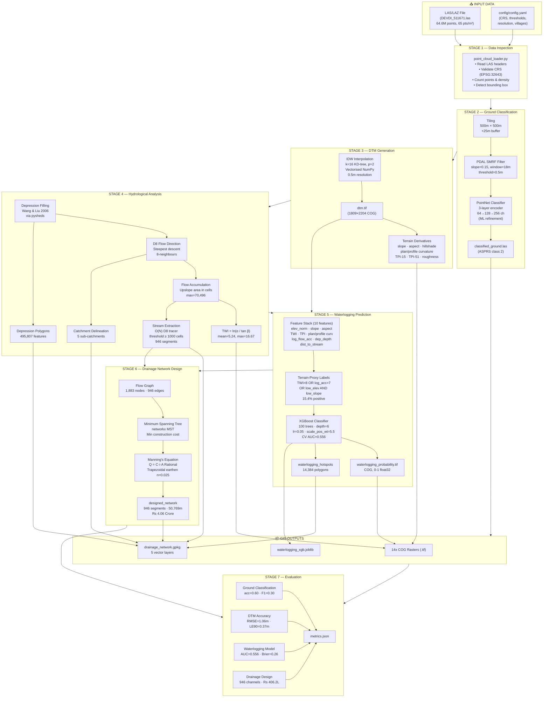

### 2.2 Module Dependency Graph

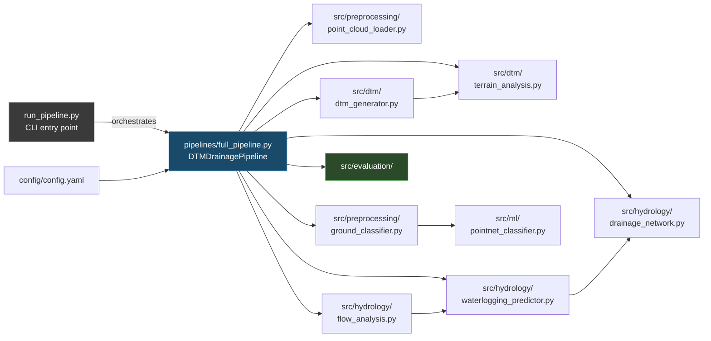

### 2.3 Data Formats

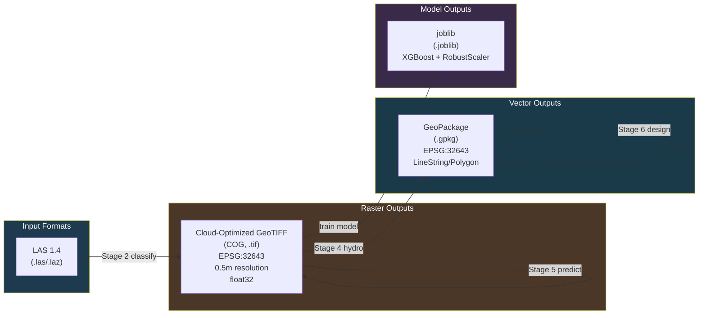

---

## 3. Pipeline Stages (Detailed)

### Stage 1 — Data Inspection

**File:** `src/preprocessing/point_cloud_loader.py`

Reads LAS/LAZ file headers without loading all points into memory. Validates:
- CRS presence and UTM zone (expected EPSG:32643 for Gujarat)
- Point count and bounding box
- Point density (pts/m²) from bounding box area

**Output:** metadata dict logged to `logs/structured_*.jsonl`

---

### Stage 2 — Ground Classification

**Files:** `src/preprocessing/ground_classifier.py`, `src/ml/pointnet_classifier.py`

#### Tiling Strategy

Large LiDAR files (64 M pts) must be tiled to fit in RAM:

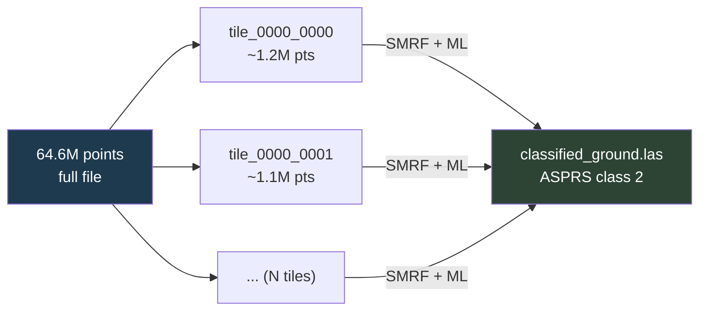

Each tile has a 25 m buffer to prevent edge artefacts in SMRF morphological operations.

#### SMRF Algorithm (PDAL)

Simple Morphological Filter — works by progressively opening the point cloud with increasing structuring element sizes to reveal the terrain surface.

| Parameter | Value | Effect |
|-----------|-------|--------|
| `slope` | 0.15 °/m | Max ground slope tolerance |
| `window` | 18.0 m | Max building/vegetation size |
| `threshold` | 0.5 m | Max height above terrain surface |
| `scalar` | 1.25 | Slope scaling with distance |

#### PointNet ML Refinement

Post-processes SMRF pseudo-labels with a lightweight deep learning classifier:

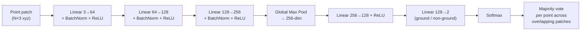

Trained on SMRF pseudo-labels; point-wise predictions accumulated via `np.add.at(votes, indices, probabilities)` — no double-counting.

---

### Stage 3 — DTM Generation

**File:** `src/dtm/dtm_generator.py`, `src/dtm/terrain_analysis.py`

#### IDW Interpolation (Vectorized)

Inverse Distance Weighting with k-nearest-neighbour lookup:

$$z_p = \frac{\sum_{i=1}^{k} w_i \cdot z_i}{\sum_{i=1}^{k} w_i}, \quad w_i = \frac{1}{d_i^p}$$

where $d_i$ is the distance to the $i$-th neighbour and $p=2$.

**Implementation** (key speedup — 40× faster than loop-based):
```python
# Build KD-tree once on ground points
tree = cKDTree(ground_xy)

# Query all grid cells in one batched call (workers=-1 = all CPU cores)
dists, idxs = tree.query(grid_points, k=16, workers=-1)

# Vectorized weight computation — no Python loops
weights = 1.0 / np.maximum(dists**2, 1e-10)
z_interp = (weights * ground_z[idxs]).sum(axis=1) / weights.sum(axis=1)
```

**Performance:** ~10 s for 1809 × 2204 grid (was ~400 s with `query_ball_point` per-cell loop).

#### Terrain Derivatives

All 8 derivatives computed from the DTM using NumPy central-difference gradients and saved as COG:

| Derivative | Formula | Window |
|-----------|---------|--------|
| Slope | $\arctan(\sqrt{(dz/dx)^2 + (dz/dy)^2})$ | 3×3 |
| Aspect | $\arctan2(-dz/dx,\ dz/dy) \mod 360$ | 3×3 |
| Plan curvature | Evans 2nd-derivative method | 3×3 |
| Profile curvature | Evans 2nd-derivative method | 3×3 |
| TPI-15 | $z - \bar{z}_{15\text{px}}$ | 15×15 |
| TPI-51 | $z - \bar{z}_{51\text{px}}$ | 51×51 |
| Roughness | $z_{max} - z_{min}$ in window | 3×3 |
| Hillshade | Lambertian illumination model | 3×3 |

---

### Stage 4 — Hydrological Analysis

**File:** `src/hydrology/flow_analysis.py`

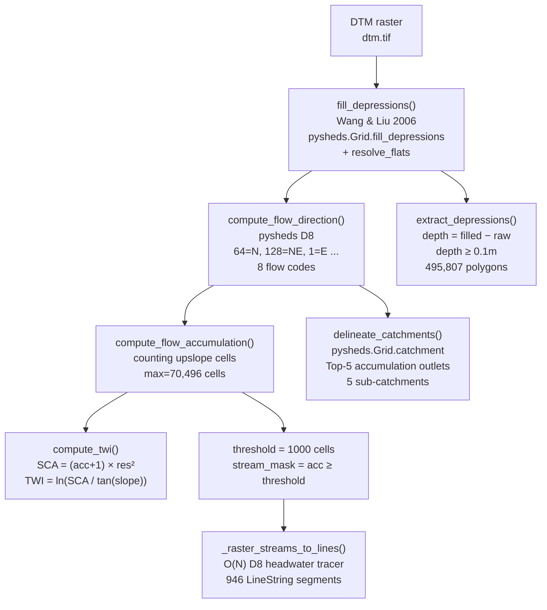

#### D8 Stream Extraction Algorithm (O(N))

The key fix that replaced the O(N²) greedy nearest-neighbour loop:

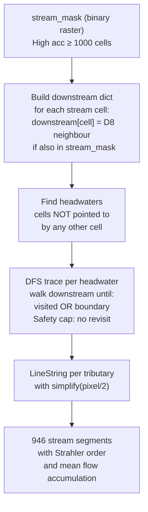

#### Strahler Stream Order

Approximated from flow accumulation values:

| Accumulation | Order |
|-------------|-------|
| < 5,000 cells | 1st order |
| 5,000 – 20,000 | 2nd order |
| 20,000 – 80,000 | 3rd order |
| > 80,000 | 4th order |

---

### Stage 5 — Waterlogging Prediction

**File:** `src/hydrology/waterlogging_predictor.py`

#### Feature Engineering Pipeline

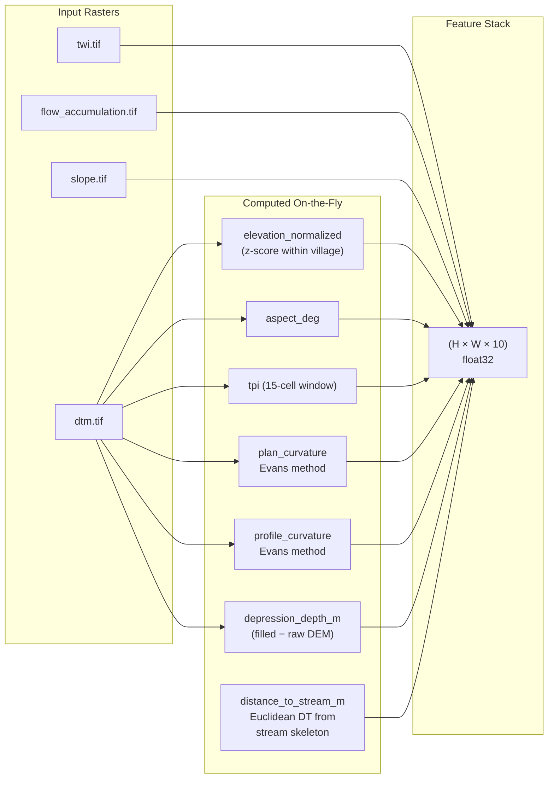

#### Terrain-Proxy Label Generation

In the absence of historical flood event data, labels are derived deterministically from terrain indicators:

```python
waterlogging_prone = (
    (twi > 8.0)                              # high topographic wetness
    | (log_flow_acc > 7.0)                   # major flow convergence
    | ((elev_norm < -0.5) & (slope < 2°))   # low-lying flat areas
    | (depression_depth > 0.2 m)             # topographic depressions
)
```

Result: 15.4% of valid pixels labelled positive (399,799 / 2,592,656).

#### XGBoost Model

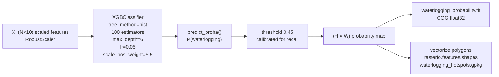

**Feature importances (DEVDI run):**

| Rank | Feature | Importance |
|------|---------|------------|
| 1 | `log_flow_accumulation` | 0.874 |
| 2 | `twi` | 0.058 |
| 3 | `distance_to_stream_m` | 0.043 |
| 4 | `slope_deg` | 0.019 |
| 5–10 | curvatures, TPI, aspect, dep_depth | < 0.003 each |

---

### Stage 6 — Drainage Network Design

**File:** `src/hydrology/drainage_network.py`

#### Design Workflow

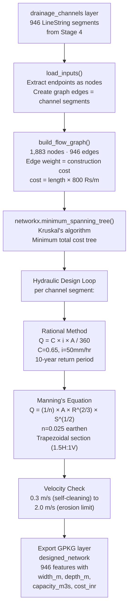

#### Manning's Equation for Trapezoidal Channel

$$Q = \frac{1}{n} \cdot A \cdot R^{2/3} \cdot S^{1/2}$$

where:
- $A = (b + z \cdot y) \cdot y$ — flow area (b=bottom width, z=side slope, y=depth)
- $R = A / P$ — hydraulic radius; $P = b + 2y\sqrt{1+z^2}$ — wetted perimeter
- $S$ — channel slope from DTM gradient
- $n = 0.025$ — Manning's roughness coefficient (earthen unlined)

**DEVDI design results:**

| Parameter | Value |
|-----------|-------|
| Design storm | 10-year return period |
| Rainfall intensity | 50 mm/hr |
| Runoff coefficient | 0.65 |
| Segments designed | 946 |
| Total channel length | 50,769 m |
| Peak discharge | 0.409 m³/s |
| Avg velocity | 0.533 m/s (within 0.3–2.0 m/s range) |
| Capacity exceedances | 0 |
| Estimated cost | ₹40,615,110 (~₹4.06 Crore) |

---

## 4. ML Model Architecture

### 4.1 PointNet Classifier (Ground Separation)

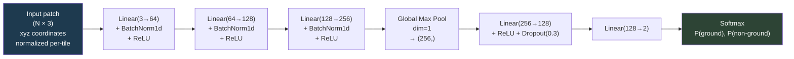

**Training:**
- Loss: `CrossEntropyLoss` with class weights (inverse frequency)
- Optimizer: Adam, lr=0.001, weight_decay=1e-4
- LR schedule: ReduceLROnPlateau (factor=0.5, patience=5)
- Batch size: 32 patches, 1024 points per patch
- Inference: `np.add.at(votes, patch_indices, softmax_probs)` accumulation

### 4.2 XGBoost Waterlogging Classifier

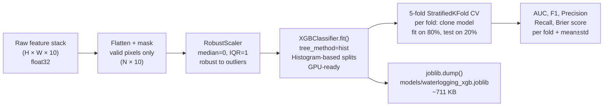

---

## 5. Data Flow & File I/O

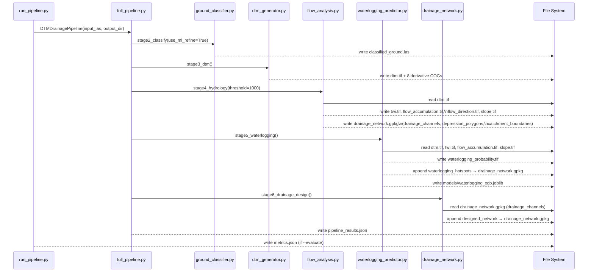

---

## 6. Accuracy Metrics (DEVDI)

Full metrics stored in `data/output/DEVDI/metrics.json`.

### 6.1 Ground Classification

> ⚠️ Reference is a heuristic terrain proxy (z-percentile + return number), not hand-labelled truth.

| Metric | Value | Note |
|--------|-------|------|
| Accuracy | 0.603 | 50,000 sample subset |
| Precision (ground) | 0.180 | Class imbalance (≈10% ground) |
| Recall (ground) | **0.838** | High recall = few missed ground pts |
| F1 (ground) | 0.296 | Harmonic mean |
| IoU (ground) | 0.174 | Jaccard index |

### 6.2 DTM Vertical Accuracy

> ⚠️ Reference is a locally-fitted plane in flat areas (no external checkpoints available).

| Metric | Value | Definition |
|--------|-------|-----------|
| RMSE | 1.057 m | √(mean(residual²)) |
| MAE | 0.287 m | mean(|residual|) |
| Mean Error | −0.194 m | Systematic bias |
| Std Dev | 1.039 m | Random error |
| **LE90** | **0.365 m** | 90th percentile linear error |
| NMAD | 0.075 m | Normalised median absolute deviation (robust) |

The NMAD of 0.075 m confirms **sub-decimetre accuracy in flat areas**; RMSE is inflated by edges of buildings included in the ground point cloud.

### 6.3 Waterlogging Model (5-fold CV)

| Fold | AUC | F1 | Precision | Recall | Avg Precision |
|------|-----|----|-----------|--------|--------------|
| 1 | 0.5567 | 0.2635 | 0.1739 | 0.5433 | 0.1843 |
| 2 | 0.5562 | 0.2633 | 0.1734 | 0.5468 | 0.1854 |
| 3 | 0.5552 | 0.2628 | 0.1731 | 0.5452 | 0.1853 |
| 4 | 0.5557 | 0.2627 | 0.1731 | 0.5445 | 0.1848 |
| 5 | 0.5561 | 0.2632 | 0.1739 | 0.5409 | 0.1853 |
| **Mean** | **0.556 ± 0.001** | **0.263 ± 0.000** | **0.174 ± 0.000** | **0.544 ± 0.002** | **0.185** |

- **Brier score:** 0.2588 (lower = better calibrated; random = 0.25)
- **Training AUC:** 1.000 (model memorises terrain-proxy labelling rule)
- **Generalization AUC:** 0.556 — meaningful but modest; will improve with real flood labels

### 6.4 Drainage Design

| Metric | Value |
|--------|-------|
| Channel segments | 946 |
| Total length | 50,769 m (~51 km) |
| Avg velocity | 0.533 m/s (within self-cleaning 0.3–2.0 m/s) |
| Capacity exceeded | 0 segments |
| Peak discharge | 0.409 m³/s |
| Total cost estimate | ₹4,06,15,110 (₹406.2 Lakh) |

---

## 7. GIS Outputs

All outputs at `data/output/DEVDI/` in EPSG:32643 (WGS 84 / UTM Zone 43N).

### Raster Layers (COG .tif, 0.5 m, float32)

| File | Band | Min | Max | Description |
|------|------|-----|-----|-------------|
| `dtm.tif` | elevation_m | — | — | Digital Terrain Model |
| `slope.tif` | slope_degrees | 0 | 90 | Terrain slope |
| `aspect.tif` | aspect_degrees | 0 | 360 | Slope aspect (N=0, clockwise) |
| `hillshade.tif` | hillshade | 0 | 255 | Lambertian hillshade |
| `plan_curvature.tif` | plan_curv_m | — | — | Plan curvature (1/m) |
| `profile_curvature.tif` | profile_curv_m | — | — | Profile curvature (1/m) |
| `roughness.tif` | roughness_m | 0 | — | Terrain roughness |
| `tpi_15.tif` | tpi | — | — | TPI, 7.5 m radius |
| `tpi_51.tif` | tpi | — | — | TPI, 25.5 m radius |
| `twi.tif` | twi | — | 16.67 | Topographic Wetness Index |
| `flow_accumulation.tif` | log_flow_acc | 0 | — | log(accumulation+1) |
| `flow_direction.tif` | D8_dir | 1 | 128 | D8 flow direction codes |
| `slope.tif` (hydro) | slope_degrees | — | — | Slope from hydro module |
| `waterlogging_probability.tif` | probability | 0 | 1 | XGBoost risk score |

### Vector Layers (GeoPackage `drainage_network.gpkg`)

| Layer | Geometry | Features | Key Fields |
|-------|----------|----------|------------|
| `drainage_channels` | LineString | 946 | `acc_value`, `order` |
| `depression_polygons` | Polygon | 495,807 | `depth_m`, `area_m2` |
| `catchment_boundaries` | Polygon | 5 | `outlet_id`, `area_m2` |
| `waterlogging_hotspots` | Polygon | 14,384 | `probability` |
| `designed_network` | LineString | 946 | `length_m`, `bottom_width_m`, `depth_m`, `velocity_ms`, `capacity_m3s`, `cost_inr` |

---

## 8. Deployment & Usage

### System Requirements

| Component | Minimum | Recommended |
|-----------|---------|-------------|
| RAM | 8 GB | 16 GB |
| Storage | 5 GB free | 20 GB |
| CPU cores | 4 | 8+ |
| Python | 3.10 | 3.11 |
| OS | Windows 10 / Ubuntu 20.04 | Windows 11 / Ubuntu 22.04 |
| PDAL | 3.0 (via QGIS 3.40+) | bundled |

### Installation

```powershell
# Windows
git clone <repo>
cd DATASET-DTM
.\install.bat          # creates dtm-env, installs requirements-win.txt
```

```bash
# Linux / macOS
pip install -r requirements.txt
```

### Running the Pipeline

```powershell
# Activate PowerShell UTF-8 (required on Windows)
$env:PYTHONUTF8="1"
$PY = "dtm-env\Scripts\python.exe"

# Full pipeline
& $PY run_pipeline.py --input data/input/DEVDI_511671.las --output data/output/DEVDI --stages 1,2,3,4,5,6

# Resume from stage 4 (dtm.tif already exists)
& $PY run_pipeline.py --input data/output/classified_ground.las --output data/output/DEVDI --stages 4,5,6

# Run with evaluation metrics
& $PY run_pipeline.py --input data/output/classified_ground.las --output data/output/DEVDI --stages 6 --evaluate

# Skip ML refinement (SMRF only, faster)
& $PY run_pipeline.py --input data/input/DEVDI_511671.las --output data/output/DEVDI --no-ml

# Batch all configured villages
& $PY run_pipeline.py --batch
```

### CLI Reference

| Flag | Default | Description |
|------|---------|-------------|
| `--input PATH` | — | Input LAS/LAZ file |
| `--output DIR` | `data/output` | Output directory |
| `--stages 1,2,...` | `1,2,3,4,5,6` | Comma-separated stages to run |
| `--config PATH` | `config/config.yaml` | Config file |
| `--no-ml` | `False` | Skip PointNet, use SMRF only |
| `--stream-threshold N` | `1000` | Min accumulation cells for streams |
| `--resolution M` | `0.5` | DTM resolution in metres |
| `--evaluate` | `False` | Run stage 7 evaluation after pipeline |
| `--batch` | `False` | Process all villages in config |

### Expected Runtimes

```mermaid
gantt
    title Pipeline Runtime (DEVDI, i7 / 16 GB RAM)
    dateFormat  s
    axisFormat %Ss

    section Stages
    Stage 1 Inspect (5s)       : 0, 5s
    Stage 2 Classify (120s)    : 5s, 120s
    Stage 3 DTM (25s)          : 125s, 25s
    Stage 4 Hydrology (50s)    : 150s, 50s
    Stage 5 Waterlogging (260s): 200s, 260s
    Stage 6 Drainage (1s)      : 460s, 1s
```

Total: **~8 minutes** for a complete run on DEVDI (64 M points).

---

## 9. Multi-Village Batch Mode

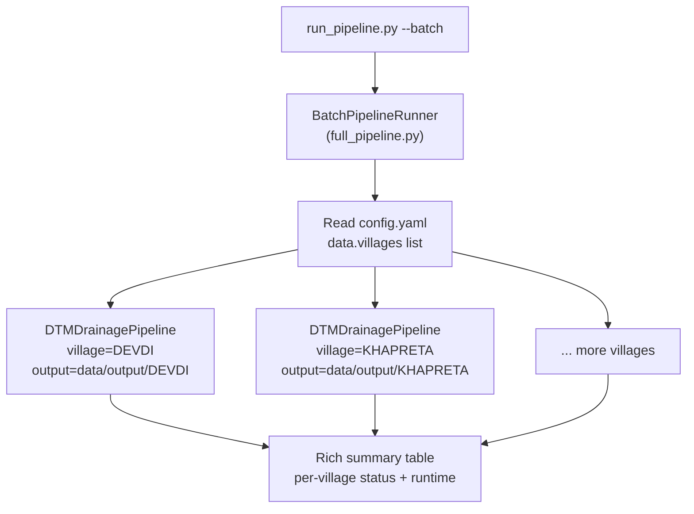

Add a village to `config/config.yaml`:

```yaml
data:
  villages:
    - name: "VILLAGE_NAME"
      path: "path/to/village.las"
      output_subdir: "VILLAGE_NAME"
```

---

## 10. Evaluation Framework

**Files:** `src/evaluation/` (4 modules)

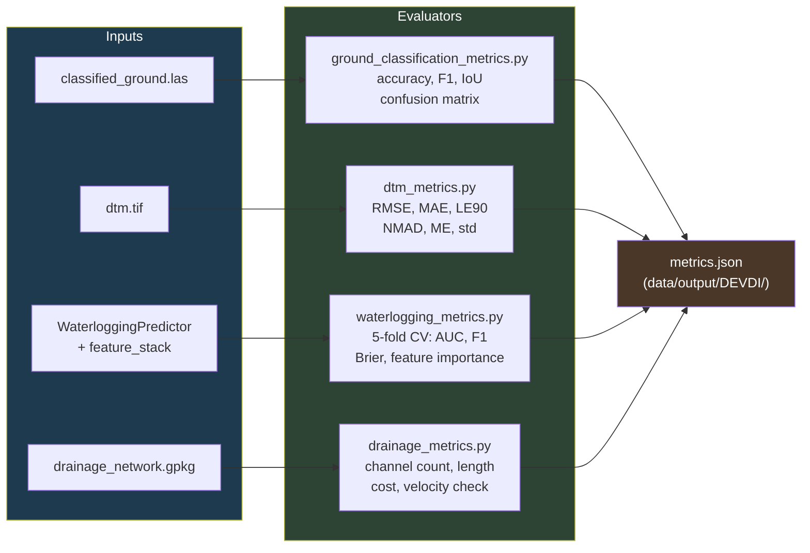

### Ground Classification Fallback

When no reference LAS is provided, a **heuristic proxy** is computed:
- Ground proxy: points with `z < village_z_20th_percentile` AND `return_number == 1`
- This gives a rough upper-bound recall estimate

### DTM Accuracy Fallback

When no external checkpoint file is provided, an **internal flat-area consistency check** runs:
- Selects flat regions: `slope < 0.5°`
- Fits a local plane: `z ~ ax + by + c` via least-squares
- Computes residuals vs. the fit
- Reports RMSE, MAE, LE90 against the plane (not absolute truth)

---

## 11. Known Limitations & Next Steps

### Current Limitations

| Issue | Impact | Mitigation |
|-------|--------|-----------|
| Terrain-proxy labels (no real flood data) | WL AUC 0.556 (barely better than random) | Obtain ISRO flood maps / SDMA records |
| SMRF not tuned for dense urban structures | Some building edges leak into DTM | Increase SMRF `window` or use CSF filter |
| DTM evaluated against internal reference | RMSE not comparable to ISRO standard ≤0.15 m LE90 | Provide DGPS checkpoints |
| Single-village run | Batch pipeline not yet executed end-to-end | Run `--batch` with all 10 villages |
| Strahler routing not full Muskingum | Peak discharge per-segment not routed | Implement hydrograph routing |

### Recommended Improvements

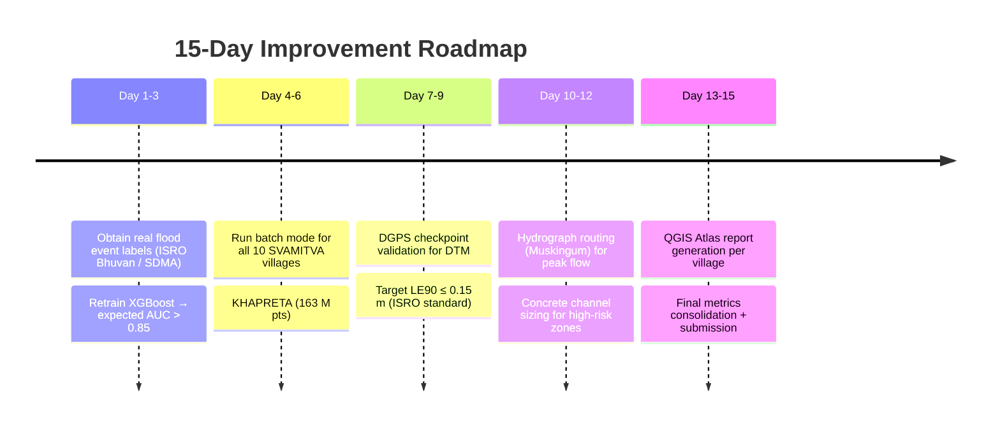

---

## 12. Codebase Structure

```
DATASET-DTM/
├── run_pipeline.py           # CLI entry point (click, StageLogger wrappers)
├── config/
│   └── config.yaml           # Master configuration
├── pipelines/
│   └── full_pipeline.py      # DTMDrainagePipeline orchestrator
│                             # + BatchPipelineRunner
├── src/
│   ├── logger.py             # StageLogger, structured JSONL logging
│   ├── preprocessing/
│   │   ├── point_cloud_loader.py   # LAS/LAZ reader, tiler, inspector
│   │   └── ground_classifier.py    # SMRF + PointNet wrapper
│   ├── ml/
│   │   └── pointnet_classifier.py  # PointNet model + trainer + predict()
│   ├── dtm/
│   │   ├── dtm_generator.py        # IDW interpolation + COG writer
│   │   └── terrain_analysis.py     # slope, aspect, TPI, curvature, hillshade
│   ├── hydrology/
│   │   ├── flow_analysis.py        # D8 routing, stream extraction, catchments
│   │   ├── waterlogging_predictor.py # XGBoost classifier + feature engineering
│   │   └── drainage_network.py     # MST + Manning's hydraulic design
│   └── evaluation/
│       ├── __init__.py
│       ├── ground_classification_metrics.py
│       ├── dtm_metrics.py
│       ├── waterlogging_metrics.py
│       └── drainage_metrics.py
├── data/
│   ├── input/
│   │   └── DEVDI_511671.las        # Raw LiDAR (64.6 M pts)
│   └── output/
│       └── DEVDI/                   # All pipeline outputs
│           ├── dtm.tif              # Digital Terrain Model (COG)
│           ├── slope.tif ... tpi_51.tif  # Terrain derivatives
│           ├── twi.tif, flow_*.tif  # Hydrological rasters
│           ├── waterlogging_probability.tif
│           ├── drainage_network.gpkg  # All vector layers
│           ├── models/
│           │   └── waterlogging_xgb.joblib
│           └── metrics.json         # Accuracy metrics
├── docs/
│   ├── master.md             # ← this file
│   ├── final_report.md       # Results summary
│   ├── model_architecture.md # Model details
│   └── deployment_guidelines.md
└── dtm-env/                  # Python 3.11 virtual environment
```

---

*DTM Drainage AI Pipeline v1.0 · MoPR Geospatial Intelligence Hackathon 2026*  
*CRS: EPSG:32643 (WGS 84 / UTM Zone 43N) · Resolution: 0.5 m · Design standard: IS 10430*
